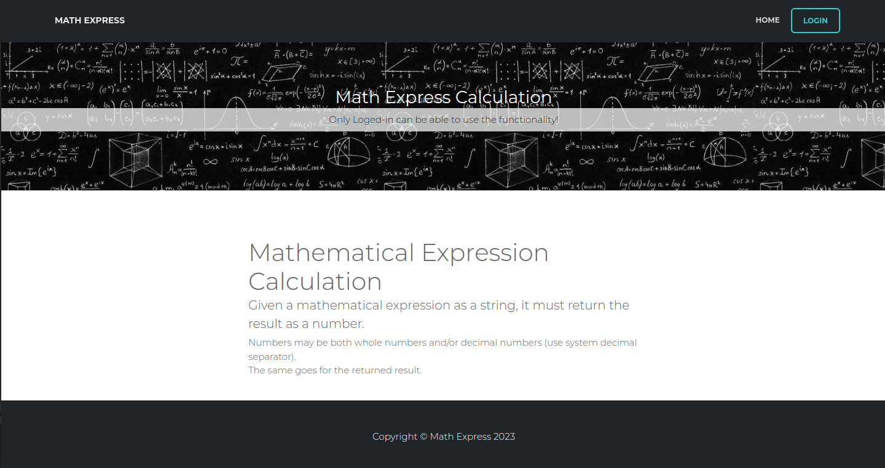

# MathExpress

### Reverse Polish Notation arithmetic expression calculation app
###

  

## GIT url

https://github.com/EdKhachatryan/math-express

## Tech-Stack 

- Nx (Web developers): [https://nx.dev/latest/angular/getting-started/getting-started]()
- Angular 15.1: [https://angular.io/guide/what-is-angular]()

## Installation

Install dependencies

```sh
$ yarn
```

### Start JSON DB server

```sh
$ yarn server
```

### Start development server

```sh
$ yarn start
```

## Build

```sh
$ yarn build
```
